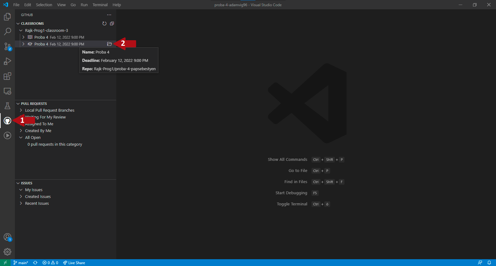
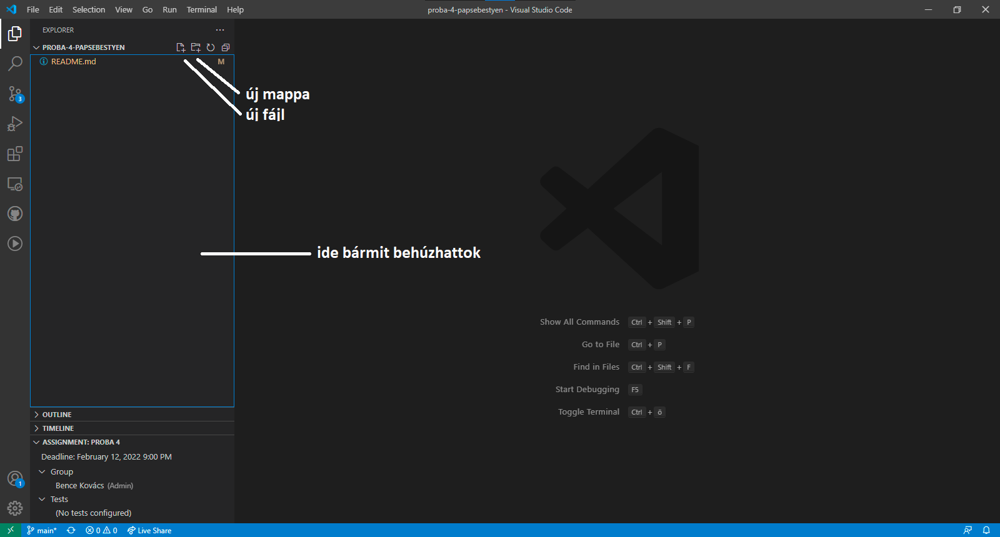
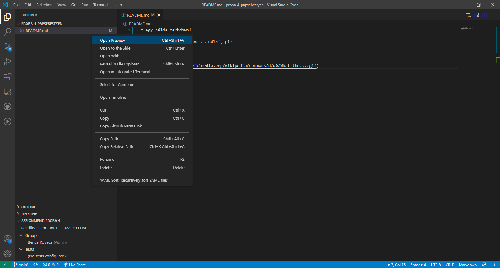
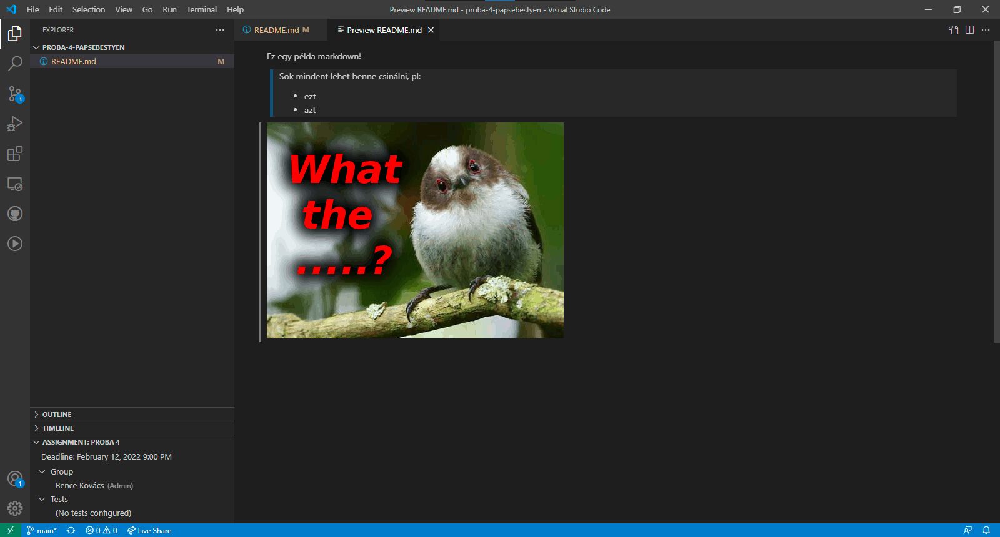
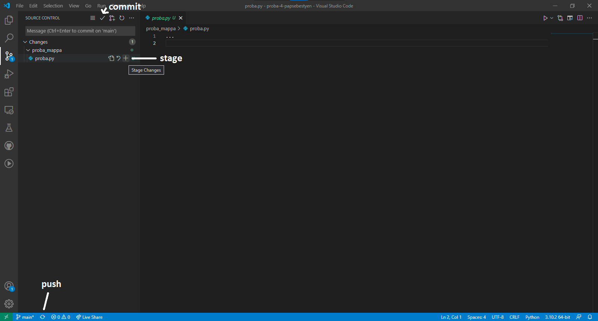

A **Visual Studio Code** egy Microsoft által kiadott IDE (*Integrated Development Environment*), amely számos hasznos funkcióval rendelkezik, például a **GitHub Classroom** funkcióval is.

> Később szó lesz még róla, hogy mi az a IDE, de most egyelőre fogjátok fel úgy, hogy egy felpimpelt szövegszerkesztő.

# Classroom

Miután elfogadtok egy nektek kiküldött assignmentet, létre fog jönni egy saját **repository** minenki nevére.

> A repository egy olyan mappára utal, amelyben valamilyen verziókövető rendszer folyamatosan figyeli a változásokat. Később szó lesz még róla a kurzuson.

A nektek létrehozott repositoryban tudtok majd házit leadni, de ehhez először le kell töltsétek a saját gépetekre a GitHub-ról.

Töltsétek le és telepítsétek a Git-et, majd egy terminálban az alábbi két parancsot kell kiadnotok:

```bash
git config --global user.email "you@example.com"
git config --global user.name "Your Github Name"
```

> A terminálról (CLI) még szó lesz később. Windows-on *cmd*, MAC-en *terminal* név alatt találjátok meg.

Ezután telepíteni kell a VSCode-ban a **GitHub Classroom** bővítményt. Ezt jobb oldalon a **Extensions** fül alatt tehetitek meg.

Miután települt a bővítmény, jobb oldalt látni fogjátok a GitHub logót. Ha rámentek az alábbi képet kell lássátok:



Fent láthatjátok az egyes assignmenteket. Itt válasszátok ki azt amelyiken dolgozni akartok és a kis mappa ikonnal nyissátok meg.

# Mappastruktúra

A VSCode-ban mindig egy adott mappában (repositoryban) tudtok dolgozni. Az ott levő mappákat és fájlokat az **explorer fülön** láthatjátok (*mappa ikon bal fent*).



Itt hozhattok létre új fájlokat és mappákat is, de a gépetekről is behúzhattok ide amit csak akartok (pl képeket).

# Markdown

A Markdown egy egyszerű jelölőnyelv formázott szöveg létrehozásához. Például ez a dokumentum is markdownban készült. **A házifeladatok leírását is ebben fogjátok megkapni!**

A markdown fájloknak .md kiterjesztése van, és alapból nem igazán látványosak. Ahhoz hogy embernek is olvasható legyen **renderelni kell valahogy**. 

Ezt a GitHub oldalon alapból megtörténik, de a VSCode-ban nem. Ott ha rámentek egy markdown fájlra és jobb klikk után kiválasztjátok az **Open Preview** opciót, akkor megjelenik a vizuális formája.



Íme:



# Házik leadása

A házik leadásához fel kell töltenetek a lokálisan (saját gépeteken) meglévő fájlokat a GitHub-ra.

Ehhez menjetek baloldalt a **Source control** fülre. Itt látjátok hogy mi változott a repositoryban az utolsó mentett módosítás óta. 

### **Leadás menete**

1. Ha fel akartok tölteni egy kész házit, akkor először bele kell tegyétek a **stage**-be a kis plusz ikonnal. Ezt minden olyan fájlal meg kell tenni amit fel akartok tölteni! 
2. Ha minden fontos fájl bent van a stage-ben, akkor a kis pipa ikonnal **commit**-olni kell a változásokat. Ez lényegében egy-egy verziója lesz a repositorynak. 
3. Ha ez is megvolt, akkor a lenti **push** gombbal kell feltölteni a változásokat a GitHub-ra. Innentől lesz számunkra is látható, hogy min és hogyan dolgozatok.




